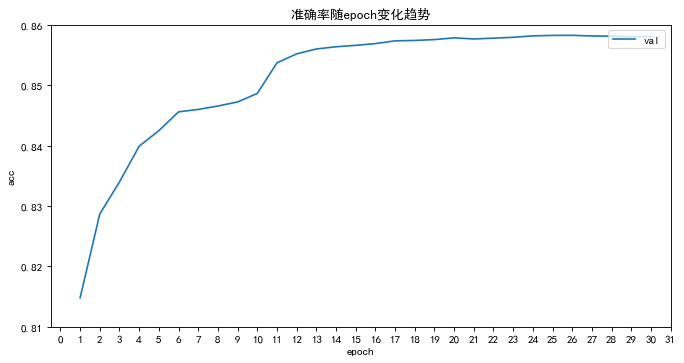

## Mixup模型实验结果报告

### 实验背景
Mixup由MIT和facebook提出，无论在学术界还是在工业界都有比较高的地位，成为数据增强的一种标配。

但经个人调研，网上实验结果都是基于英文数据集的，暂没发现基于中文数据集，所以决定用中文数据集(今日头条分类数据集)来实验，探讨Mixup的有效性。

实验中用到的算法来自论文：[mixup: BEYOND EMPIRICAL RISK MINIMIZATION](https://arxiv.org/pdf/1710.09412.pdf)。

### 实验目的
探讨Mixup在小样本中文数据集下的增强效果。

### 实验Mixup采用策略

1. embed: 在embedding采用Mixup策略；

2. encoder: 在编码层采用Mixup策略；

3. sent: 在pool层采用Mixup策略。

### 实验数据

#### 1. 全量数据分布

训练集总共15个类别，共计 229612 条数据。

测试集总共15个类别，共计 76538 条数据。

#### 2. 全量数据训练效果(TextCNN)

#### 3. 实验训练数据

本次实验目的为探讨小样本数据增强效果，所以选择不同批次的小样本来进行实验。

总共8个批次，包括 10, 25, 50, 100, 200, 300, 500, 800。

10批次代表每个类别10条数据，15个类别总共就有150条数据，以此类推。

#### 4. 实验测试数据

因本地gpu资源有限和任务次数较多，测试集从每个类别选取1500条数据(不足则选择该类别全部数据)。

实验测试数据总共15类别，共计 20813 条数据。

### 实验结果

为了验证 普通模型+Mixup 和 预训练模型+Mixup 的效果，分别采用了 TextCNN和chinese-base-bert 两个模型来训练，
每个模型分别采用了 none(无Mixup)、embed、encoder、sent 四种策略，分别在 10/cls、25/cls、50/cls、100/cls、200/cls、
300/cls、500/cls、800/cls 共8种批次的数据集上分别训练，全部在1500/cls 批次的测试集上验证模型效果。

#### 1. TextCNN + none

先看下TextCNN用不同批次训练数据集在测试集下的实验结果。

指标随着训练数据量的提升而增加。

#### 2. TextCNN不同批次训练数据在测试集的结果

TextCNN 不同批次训练数据 在 none(无Mixup)、embed、encoder、sent 四种策略下的实验结果。

结果一览图：

可以看出，TextCnn使用Mixup策略，效果都可以得到提升，并且embed策略提升最明显。

#### 3. chinese-base-bert + none

看下chinese-base-bert用不同批次训练数据集在测试集下的实验结果。

和TextCNN一样，指标随着训练数据量的提升而增加。

#### 4. chinese-base-bert不同批次训练数据在测试集的结果

chinese-base-bert 不同批次训练数据 在 none(无Mixup)、embed、encoder、sent 四种策略下的实验结果。

结果一览图：

可以看出，chinese-base-bert使用Mixup策略，效果基本都可以得到提升，但提升效果较TextCNN有减少，总体指标提升在0.12~1.5个点。

### 实验结果

1. Mixup总会有效果，策略使用优先顺序为 embed->sent->encoder；

2. 训练数据量越小，使用Mixp策略，提升效果越好；

3. 预训练模型因有大量先验知识，提升效果没有无预训练模型效果好；

总之，为你的训练好的模型加上Mixup策略，你的模型效果总会得到提升。

